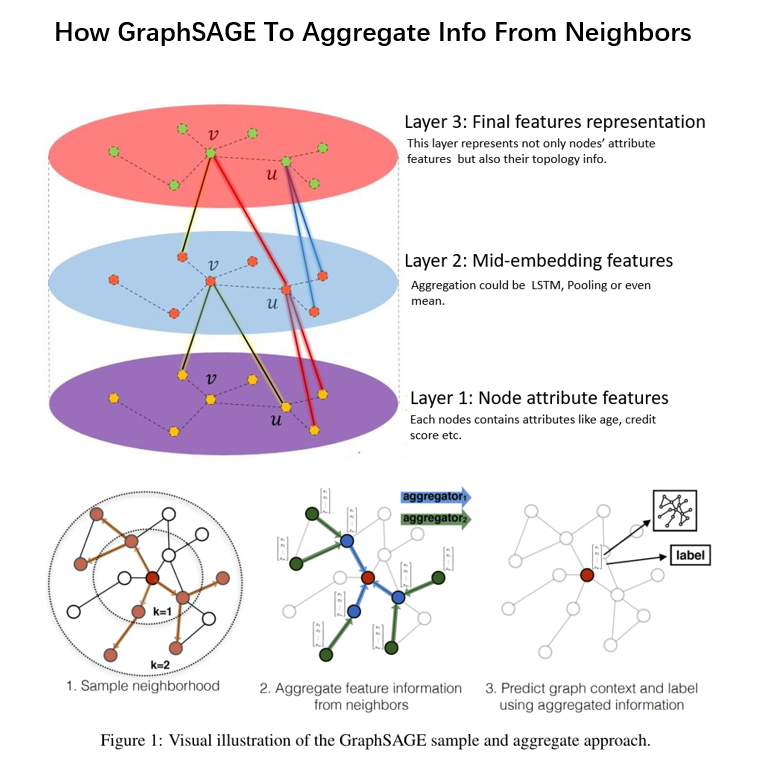

# Implementation of GraphSAGE by Tensorflow

Graph Neural Network: Nowadays, we are overwhelmed by different kinds of data, traditionally like table-like data, and unstructured data like text but when it comes graph data, how to better capture the topology information for Machine Learning is a new challenge because unlike structure data, there’re different shapes of topology that represent different topology structures. GraphSAGE is a Graph Neural Network Deep Leering model is not only able to capture the nodes’ attributes but also to represent and capture topology information for each node in a graph, for supervised machine learning.
According to the paper: https://cs.stanford.edu/people/jure/pubs/graphsage-nips17.pdf proposed by Stanford University, I implement the GraphSage and share details in codes at this Juypter notebook. 

